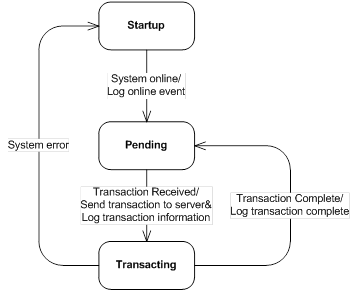

# state-machine

* A state machine outlined below

* All of the events (shown on arcs) are processed by all states
* The default treatment for events not shown in the diagram is to log the events as "unexpected” events
* A 30 second timeout added to the transaction state
* Dev Tool: Visual Studio 2013 C++
